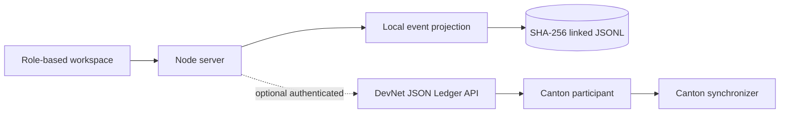

# Lookthrough architecture

## What exists in this repository

The browser is a presentation layer. Its role selector is an explicit demonstration identity picker. The Node server owns validation, role guards, timestamps and the local projection. The local event log is evidence for a reproducible demo, not a consensus layer.

The Daml package is separate from the local projection. Its templates define the intended Canton privacy boundary: GP and LP sign positions, auditors observe positions, reviewer and auditors observe drafts, and each disclosure receipt is visible only to its LP and auditors. The DevNet smoke script submits the same Daml package through the JSON Ledger API.

## DevNet boundary

When `CANTON_ACCESS_TOKEN` or the OIDC variables are configured, `server/canton.mjs` talks to the participant from the server process. The browser never receives a token. `GET /api/health` performs an authenticated ledger-end request and reports the result. `scripts/devnet-smoke.mjs --execute` uploads the DAR and performs the multi-party workflow.

The shared Season 3 participant is the default endpoint. A production deployment would add OIDC session authentication, a party-to-user authorization service and a retained PQS/PostgreSQL projection. Those pieces are planned integration work, not deployed infrastructure in this repository.

## Trust boundaries and limits

The Canton participant and synchronizer provide ledger authorization, contract visibility and transaction ordering. The GP remains responsible for the truth of NAV and disclosure text. The application does not independently verify valuations. The local host can rewrite its JSONL chain; the hash chain detects accidental edits but is not independent notarization. Redemption reserves units and records an indicative value; it does not move cash or tokens.
